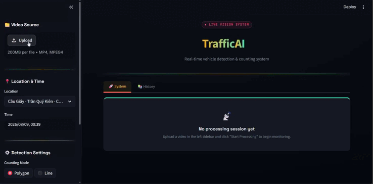
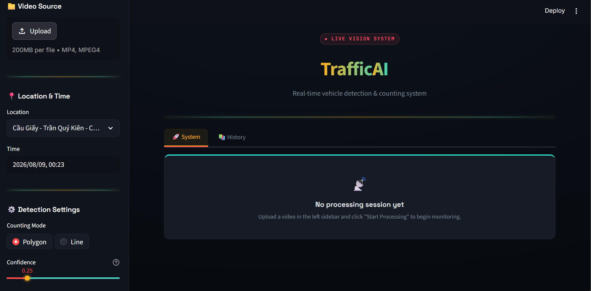
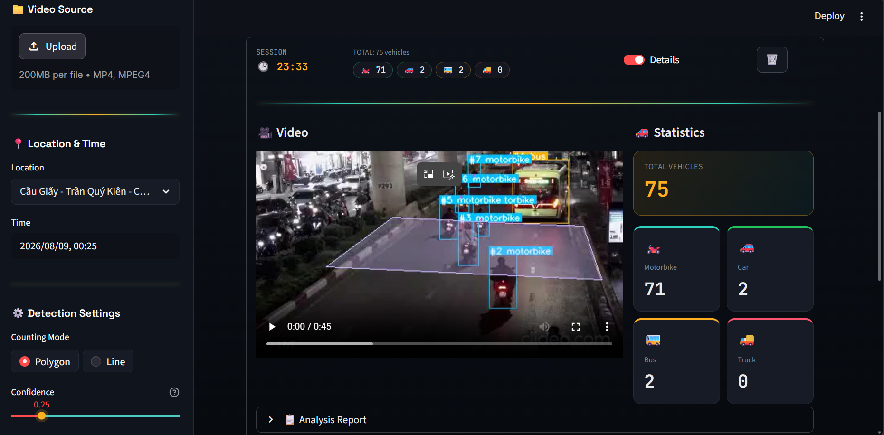
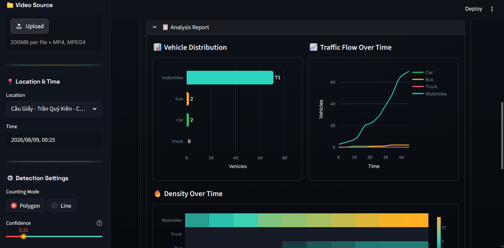
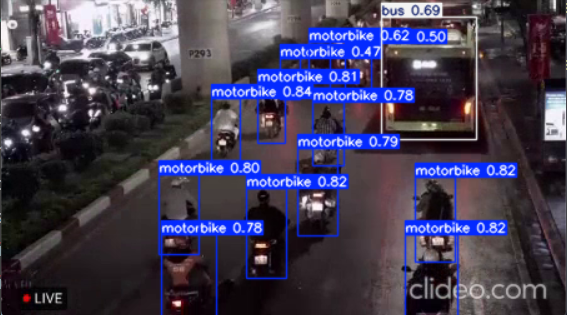

# 🚦 TrafficAI

### Real-time vehicle detection, tracking & counting for Vietnamese traffic

<p>
  
  
  
  
  
</p>

<div align="center">



</div>

<br/>

## 📖 Overview

**TrafficAI** detects, tracks, and counts vehicles from traffic-camera footage — split
out by vehicle type — and serves the results through an interactive Streamlit
dashboard. It's built and trained specifically for **Vietnamese road conditions**: dense
mixed traffic, motorbike-dominant lanes, and real intersection camera angles, where
generic Western-trained detectors tend to fall short.

<br/>

## ✨ Features

<table>
<tr><td width="40">🚗</td><td><b>Real-time detection</b></td><td>Detects vehicles frame-by-frame from live or uploaded footage</td></tr>
<tr><td>🎯</td><td><b>Stable tracking</b></td><td>ByteTrack keeps a consistent ID per vehicle across frames</td></tr>
<tr><td>🔢</td><td><b>Flexible counting</b></td><td>Configurable polygon zone <i>or</i> crossing line, per camera</td></tr>
<tr><td>🏍️</td><td><b>Multi-class</b></td><td>Cars, motorbikes, buses, and trucks counted separately</td></tr>
<tr><td>📊</td><td><b>Live dashboard</b></td><td>Upload, process, and watch counts update in the browser</td></tr>
<tr><td>🕘</td><td><b>Session history</b></td><td>Every run is saved with per-class breakdowns and daily trends</td></tr>
<tr><td>🔌</td><td><b>Pluggable weights</b></td><td>Swap in your own fine-tuned YOLO model per deployment</td></tr>
</table>

<br/>

## 🧩 How It Works

```
video input ──▶ YOLOv8 detect ──▶ ByteTrack ──▶ zone / line count ──▶ dashboard report
```

| Step | What happens |
|:--:|---|
| **1. Detect** | Each frame runs through a YOLOv8 model fine-tuned on Vietnamese traffic |
| **2. Track** | ByteTrack assigns a persistent ID to every vehicle across frames |
| **3. Count** | An ID is counted once it crosses the configured line or enters the zone |
| **4. Report** | Counts, class breakdowns, and time-series analytics are logged per session |

<br/>

## 🎬 Demo

<table>
<tr>
<td width="50%" align="center"><br/><sub><b>Main processing system</b></sub></td>
<td width="50%" align="center"><br/><sub><b>Session history</b></sub></td>
</tr>
<tr>
<td width="50%" align="center"><br/><sub><b>Session detail view</b></sub></td>
<td width="50%" align="center"><br/><sub><b>Analytics report</b></sub></td>
</tr>
</table>

<br/>

## 🚀 Quick Start

**Prerequisites:** Python 3.9+ · pip · a CUDA-capable GPU (optional, for faster inference)

```bash
# 1. Clone the repo
git clone https://github.com/<owner>/TrafficAI.git
cd TrafficAI

# 2. Install dependencies
pip install -r requirements.txt

# 3. Launch the dashboard
streamlit run ./src/app.py
```

Open `http://localhost:8501`, upload a traffic video, pick a camera location and
counting mode, then hit **Start Processing**. Every session is saved automatically and
reappears under the **Review** tab.

<br/>

## 🧠 Model & Dataset

<table>
<tr><td><b>Framework</b></td><td>YOLOv8 (Ultralytics)</td></tr>
<tr><td><b>Tracker</b></td><td>ByteTrack</td></tr>
<tr><td><b>GPU</b></td><td>NVIDIA RTX 4060 Laptop GPU</td></tr>
<tr><td><b>Dataset</b></td><td><a href="https://www.kaggle.com/datasets/duongtran1909/vietnamese-vehicles-dataset">Vietnamese Vehicles Dataset</a> (Kaggle) + real-world footage + public sources</td></tr>
</table>

📈 Training results


Tested on real-world footage

<p float="left">    </p> <br/>

<br/>

## 🛠️ Tech Stack

<table>
<tr><td>🤖 <b>AI / Vision</b></td><td>YOLOv8 (Ultralytics) · ByteTrack · OpenCV</td></tr>
<tr><td>📊 <b>Data</b></td><td>Pandas · NumPy</td></tr>
<tr><td>📈 <b>Visualization</b></td><td>Plotly</td></tr>
<tr><td>🌐 <b>Web App</b></td><td>Streamlit</td></tr>
</table>

<br/>

<div align="center">

If this project helped you, consider giving it a ⭐ — it really helps!

</div>