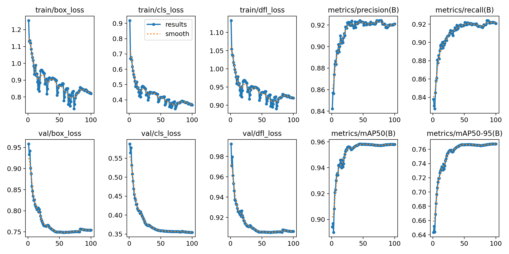
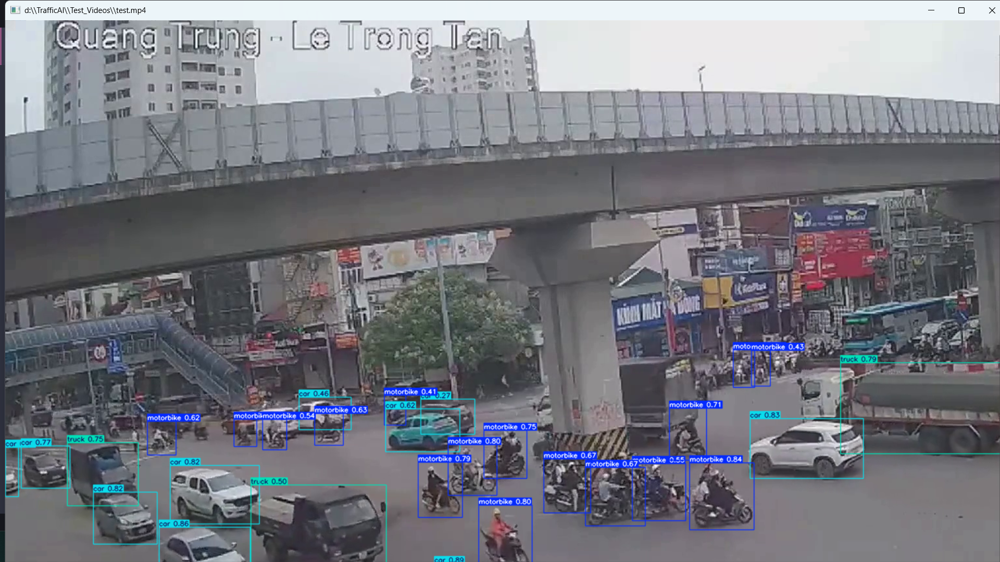
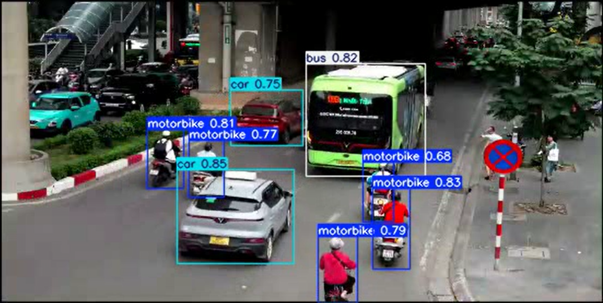
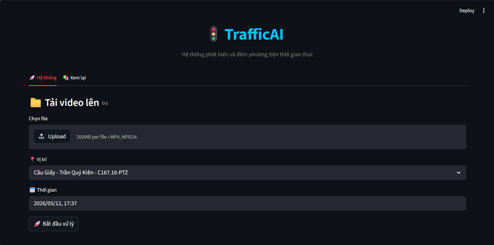
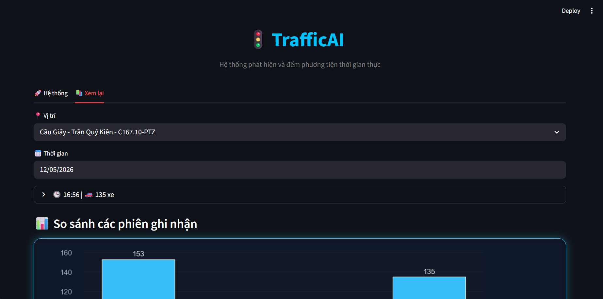
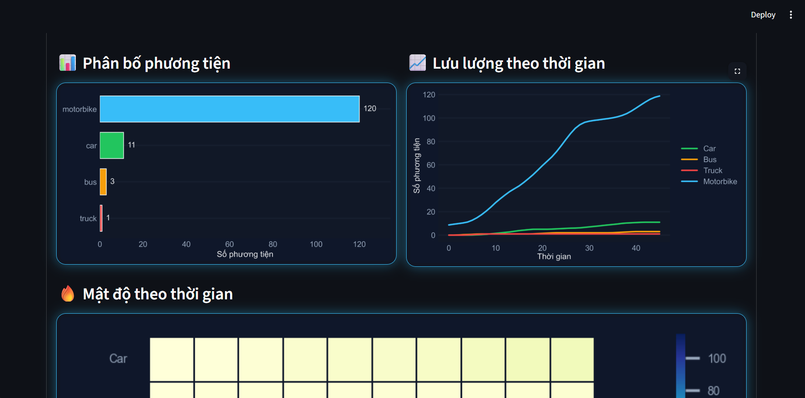
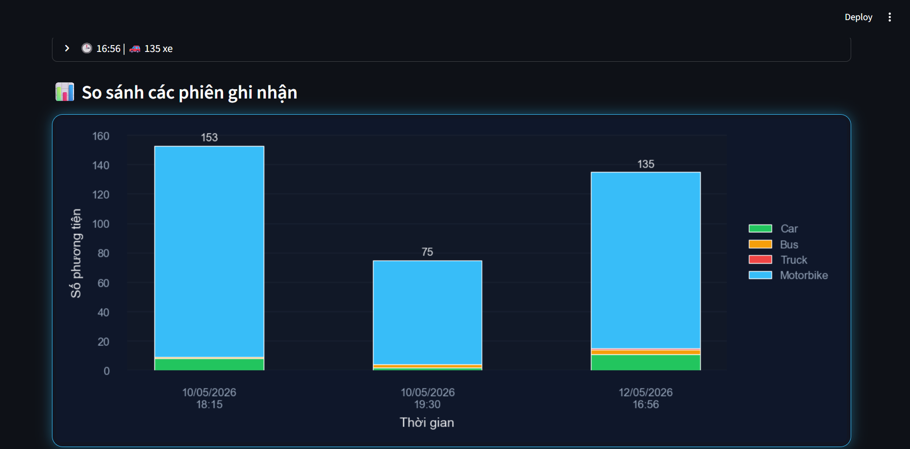

# 🚦 TrafficAI: Hệ thống phát hiện, theo dõi và đếm phương tiện lưu thông trong giao thông ở Việt Nam


---


---

## ✨ Tính năng

- Phát hiện phương tiện giao thông theo thời gian thực
- Theo dõi đối tượng bằng ByteTrack
- Đếm số lượng phương tiện theo luồng giao thông
- Hiển thị kết quả trực quan bằng Streamlit dashboard
- Hỗ trợ nhiều loại phương tiện: ô tô, xe máy, xe buýt, xe tải

---

## 📂 Dataset

- Dataset phương tiện Việt Nam từ Kaggle  
📎
https://www.kaggle.com/datasets/duongtran1909/vietnamese-vehicles-dataset
- Video giao thông thực tế tại Việt Nam  
- Một số nguồn dữ liệu công khai trên Internet  

---

## ⚙️ Cài đặt

```bash
git clone <repository-link>
cd <project-folder>
pip install -r requirements.txt
```

---

## ▶️ Chạy ứng dụng

```bash
streamlit run ./src/app.py
```

---

## 🧠 Huấn luyện mô hình

- Framework: YOLOv8 (Ultralytics)
- GPU: NVIDIA RTX 4060 Laptop GPU
- Dataset: bộ dữ liệu phương tiện giao thông Việt Nam  

Kết quả sau khi huấn luyện:


Test trên video thực:



---

## 📊 Kết quả trên Streamlit










---

## 🛠️ Công nghệ sử dụng

### 🤖 AI / Computer Vision
- YOLOv8 (Ultralytics)
- ByteTrack
- OpenCV

### 📊 Data Processing
- Pandas
- NumPy

### 📈 Visualization
- Plotly
- Matplotlib
- Seaborn

### 🌐 Web App
- Streamlit